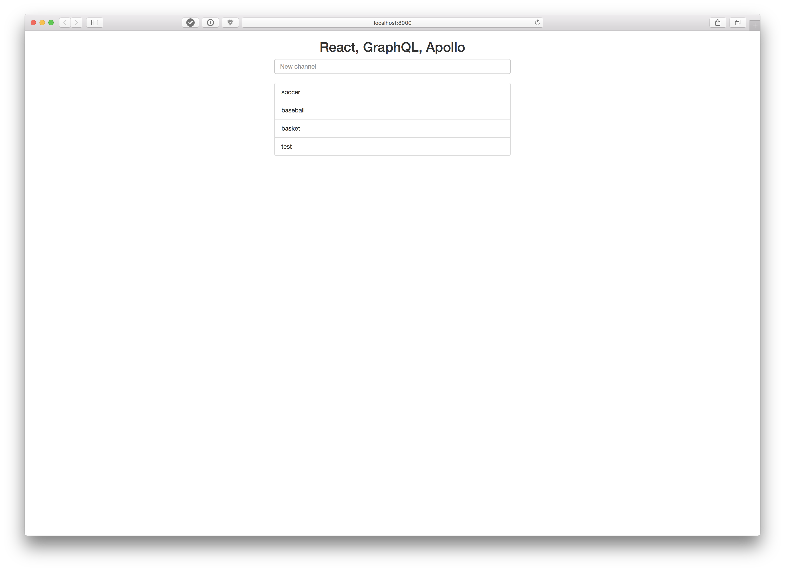

# GraphQL/Node/React Application Tutorial

This is the code written while following a tutorial for using GraphQL with Node and React. Thank you to [John Kariuki](https://scotch.io/@johnkariuki) for provding the [tutorial](https://scotch.io/tutorials/implementing-graphql-using-apollo-on-an-express-server).

### Mac installation instructions

```bash
# Install homebrew 
/usr/bin/ruby -e "$(curl -fsSL https://raw.githubusercontent.com/Homebrew/install/master/install)"
brew update

brew install node
npm i
```

## Server

### Run the server

To run the server use npm:

```bash
npm run server
```

The server will be running on `http://localhost:7700/`

### Example requests

##### Get Channels

```bash
curl --request POST \
  --url http://localhost:7700/graphql \
  --header 'content-type: application/json' \
  --data '{"query":"query {\n  channels{\n    id\n    name\n  }\n}"}'
```

##### Get Channel

```bash
curl --request POST \
  --url http://localhost:7700/graphql \
  --header 'content-type: application/json' \
  --data '{"query":"query {\n  channel(id:2){\n    name\n  }\n}"}'
```

##### Create Channel

```bash
curl --request POST \
  --url http://localhost:7700/ \
  --header 'content-type: application/json' \
  --data '{"query":"mutation {\n\taddChannel(name:\"lacrose\") {\n\t\tname\n\t}\n}"}'
```

## Client

### Run the client

```bash
npm run client
```

The client will be running at `http://localhost:8000` and can be viewed in the browser.

